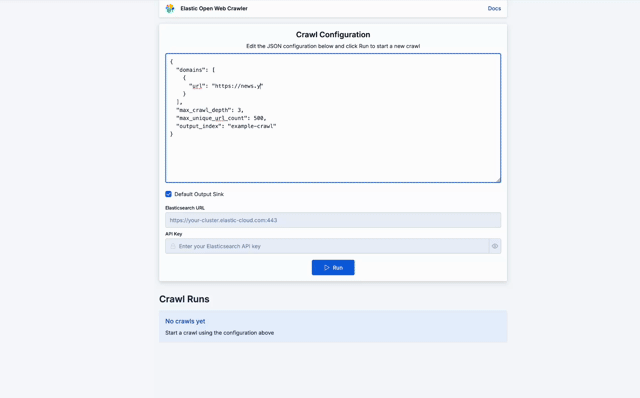
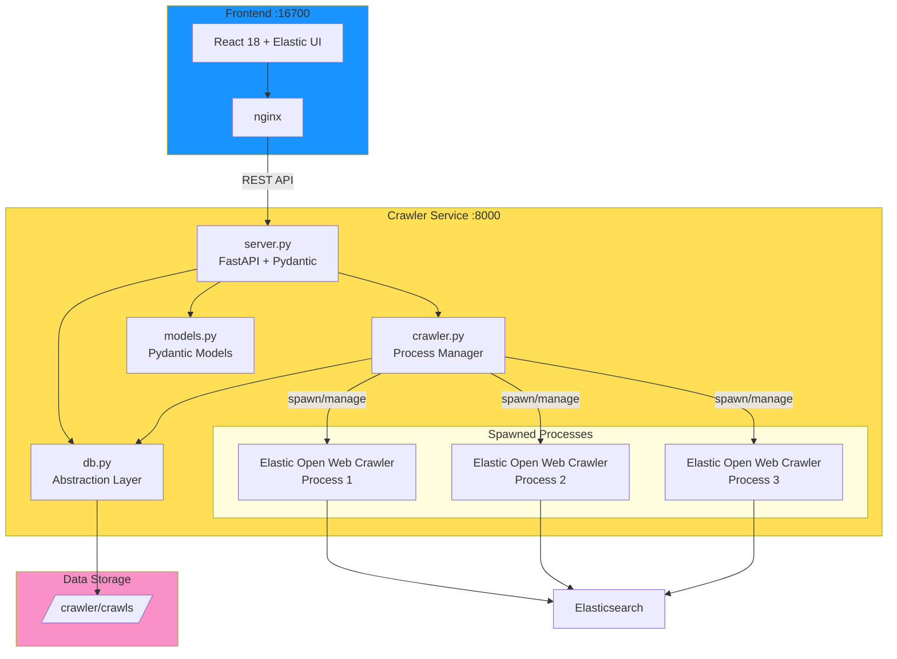

<div align="center">


**Web crawler service and UI built on top of Elastic Open Web Crawler.**

[](https://opensource.org/licenses/MIT)
[](https://www.python.org/)
[](https://fastapi.tiangolo.com/)
[](https://react.dev/)
[](https://www.docker.com/)

</div>

---

<div align="center">



</div>


## Architecture

The application consists of two microservices:

- **Frontend** (port 16700): React + Elastic UI components served by nginx
- **Crawler Service** (port 8000): FastAPI backend that manages the Elastic Crawler (JRuby)

The frontend communicates with the backend via REST API, proxied through nginx.



### Data Persistence

Crawl data is persisted to the filesystem in `/crawler/crawls/{execution_id}/`:
- `info.json` - Contains crawl configuration, status, statistics, and results
- `logs.log` - Raw crawler execution logs

The `db.py` module provides an abstraction layer that can be refactored to use Elasticsearch or another database without affecting the rest of the application.

### Key Components

**Backend:**
- `server.py` - FastAPI application with REST endpoints
- `crawler.py` - Manages crawler process execution and lifecycle
- `db.py` - Database abstraction layer (currently file-based JSON)
- `models.py` - Pydantic models for type-safe data handling
- `elasticsearch_client.py` - Elasticsearch integration utilities

**Frontend:**
- `App.jsx` - Main application with crawl configuration form
- `CrawlRuns.jsx` - Lists all crawl executions with status
- `CrawlLogs.jsx` - Modal for viewing crawler logs

## Features

- **Asynchronous Crawling**: Submit crawl jobs that run in the background
- **Real-time Monitoring**: Track crawl progress with live status updates
- **Process Management**: Cancel running crawls
- **Execution History**: View all past crawls with configuration and results
- **Log Streaming**: Access detailed crawler logs for each execution
- **Flexible Configuration**: Customize crawl depth, URL limits, and extraction rules
- **Elasticsearch Integration**: Index crawled content directly to Elasticsearch

## Stack

- **Frontend**: React 18 + Elastic UI + Vite + nginx
- **Backend**: FastAPI (Python 3.11) + Pydantic
- **Crawler**: Elastic Open Crawler (JRuby)
- **Data Storage**: File-based JSON (with abstraction for future DB migration)

## Quick Start

### Development

This starts up Crawler Service and Frontend with Vite proxy so changes are reflected immediately:

```bash
docker-compose up --build
```

### Production

Production does the actual build of the frontend and uses nginx instead of a Vite proxy.

```bash
docker-compose -f docker-compose.prod.yml up --build
```

Access the UI at: http://localhost:16700

## Configuration

### Environment Variables

```env
ES_URL=https://your-elasticsearch-url
ES_API_KEY=your-api-key
PORT=8000
```

### Crawl Configuration

Configure crawls via JSON with the following options:

```json
{
  "domains": [
    {
      "url": "https://example.com",
      "seed_urls": ["https://example.com/start"]
    }
  ],
  "output_index": "my-crawl-index",
  "max_crawl_depth": 3,
  "max_unique_url_count": 500,
  "max_duration_seconds": 3600
}
```

You can specify Elasticsearch credentials per-crawl or use the default environment variables.

## API Endpoints

### Crawl Management

- `POST /api/crawl` - Start a new crawl job
  - Request body: `CrawlConfig` JSON
  - Returns: Initial `CrawlStatus`

- `POST /api/cancel/{execution_id}` - Cancel a running crawl
  - Returns: Updated `CrawlStatus`

### Status & Monitoring

- `GET /api/status/{execution_id}` - Get crawl status
  - Returns: Complete `CrawlStatus` with config, stats, and result

- `GET /api/crawls` - List all crawls (sorted by most recent)
  - Returns: Dictionary of execution IDs to `CrawlStatus` objects

- `GET /api/logs/{execution_id}` - Get crawler logs
  - Returns: Plain text log content

- `GET /api/info/{execution_id}` - Get complete crawl information
  - Returns: Raw JSON from `info.json`

### Health

- `GET /api/health` - Service health check
  - Returns: `{"status": "healthy", "service": "crawly", "version": "1.0.0"}`

## Data Models

### CrawlStatus

The main object returned by the API, containing all crawl information:

```python
{
  "status": "started|running|completed|failed|cancelled",
  "execution_id": "uuid",
  "started_at": "ISO timestamp",
  "completed_at": "ISO timestamp",
  "message": "Human-readable status message",
  "config": {...},  # CrawlConfig
  "stats": {...},   # CrawlStats (pages visited, documents indexed, duration)
  "result": {...}   # CrawlResult (return code, errors, domains crawled)
}
```

## Development

### Project Structure

```
app/
├── crawler-service/
│   ├── app/
│   │   ├── server.py         # FastAPI application
│   │   ├── crawler.py        # Crawler process management
│   │   ├── db.py             # Persists crawls to disk
│   │   ├── models.py         # Pydantic models
│   │   └── elasticsearch_client.py
│   └── Dockerfile
├── frontend/
│   ├── src/
│   │   ├── App.jsx
│   │   └── components/
│   │       ├── CrawlRuns.jsx
│   │       └── CrawlLogs.jsx
│   └── Dockerfile
└── docker-compose.yml
```


## 📄 License

MIT © [ugosan](https://github.com/ugosan)